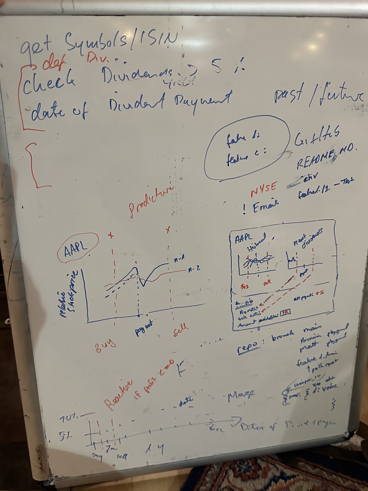

# invest
We automate investment strategies

# Current  plan



## set-up conda environment
Use the `setup_env.sh`  to create  the conda environment for this project.

```bash
chmod +x setup_env.sh
./setup_env.sh
```

# Create .env file

```bash
cp .env-change .env
```
Fill  the `.env` file  with  api key

In the notebooks folder  you  will  see  different tests that have been  tried  with different apis. Currently,  we  are  trying out the benzinga api.

# Key Commands
- [ ] List companies with dividends above a certain threshold
- [ ] Get historical dividend pay-out dates and  future payout dates along  with  stock prices and dividend amount
- [ ] 


# LLM enabled api queries
Here  is the api  specification  for  benzinga: https://github.com/Benzinga/doc-site-mintlify
Here  is some link to  langchain explaining  how  to  use natural language  queries: https://python.langchain.com/docs/use_cases/apis

# Benzinga  api  documents
https://docs.benzinga.io/home

